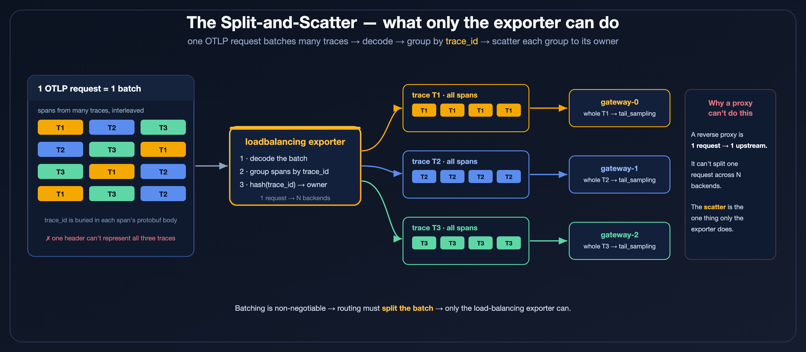
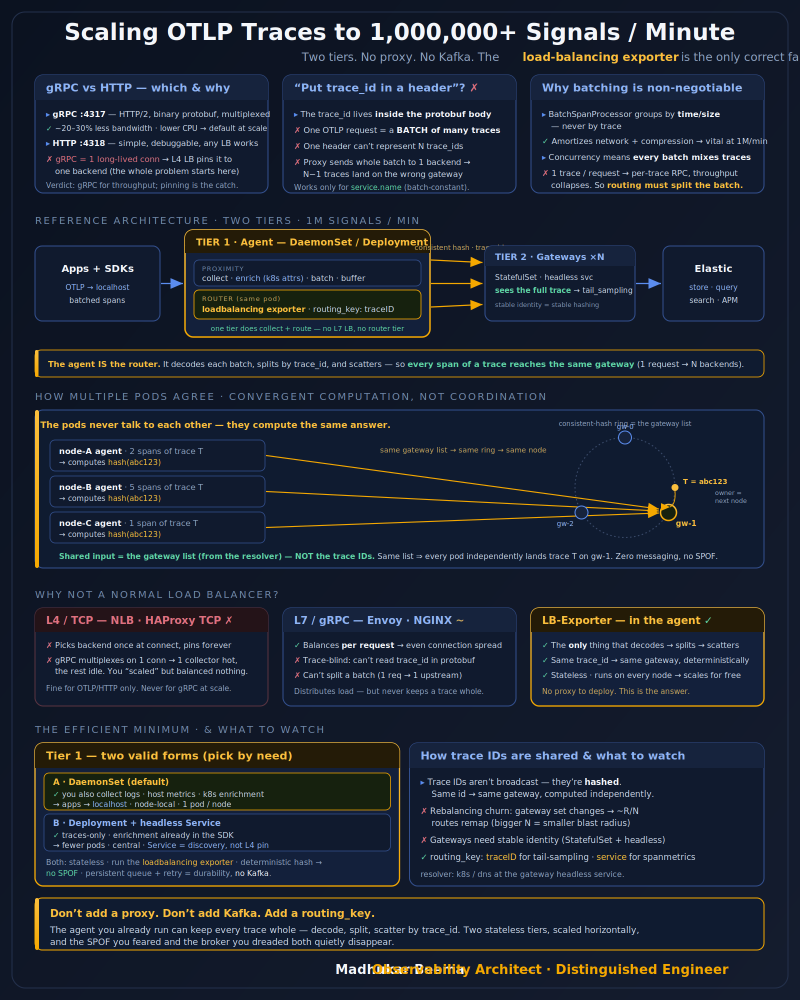

# Scaling OTLP Traces — Two-Tier Load-Balancing PoC

The thesis: at high volume you **cannot** load-balance OTLP traces with a normal proxy (F5/NGINX/Envoy) — the `trace_id` is inside the protobuf payload and one OTLP request batches many traces. The only component that can keep a trace whole is the OpenTelemetry **`loadbalancing` exporter**, which decodes the batch, splits by `trace_id`, and scatters via consistent hashing. The recommended shape is **two stateless tiers, no proxy, no Kafka**.

## Contents

| File / dir | What |
|---|---|
| `images/` | Architecture diagrams + the infographic (SVG source + PNG renders). |
| `k8s/` | Minimal local PoC — LB Deployment + 3 gateways + telemetrygen, `debug` only (no backend). Namespace `observability`. |
| `k8s/e2e-elastic/` | **Full end-to-end PoC** — LB **Deployment** + gateway **StatefulSet** + OpenTelemetry Demo → **Elastic Managed OTLP**. Namespace `otel-poc`. Start here. |

## Architecture (what the PoC builds)

```
apps / OTel Demo → agent collector
   → otel-lb       (Tier 1 · Deployment · routing_key: traceID · k8s resolver)
   → otel-gateway  (Tier 2 · StatefulSet · headless svc · tail_sampling)
   → Elastic Managed OTLP        (metrics/logs go direct from otel-lb)
```

**Kubernetes topology**


**Trace flow — same `trace_id` → same gateway**


**The split-and-scatter — why only the exporter can route by `trace_id`**



Two balancing layers, by design:
1. **client → LB**: coarse, per-connection (L4 ClusterIP). Spreads only with multiple client connections (≈ multiple agents).
2. **LB → gateway**: fine-grained, per-trace consistent hash. Deterministic, affinity-preserving — same `trace_id` → same gateway from any LB replica.

## Quick start

```bash
cd k8s/e2e-elastic
# edit Elastic creds, then:
kubectl apply -f 00-namespace.yaml -f 01-elastic-secret.yaml -f 10-gateway.yaml -f 20-lb.yaml
helm upgrade --install otel-demo open-telemetry/opentelemetry-demo -n otel-poc -f 30-demo-values.yaml
bash verify-pinning.sh        # ✅ N traces, ZERO split across gateways
```
Full runbook, verification, rebalancing test and real-run gotchas are in [`k8s/e2e-elastic/README.md`](k8s/e2e-elastic/README.md).

## Status

✅ **Verified end-to-end on 2026-06-18** (minikube `edot-demo`, collector 0.119.0, demo chart 0.40.9, real Elastic Managed OTLP):
- trace-id pinning held — 0 splits across gateways
- all gateways exported to Elastic with **0 failures**
- live 3→5 gateway rebalancing → only a bounded ~R/N set of *in-flight* traces split (the documented churn); steady-state clean
- multi-client fleet → both LB replicas balanced (per-connection L4 spread)

## Algorithms (what runs at each layer)

| Layer | Algorithm | Notes |
|---|---|---|
| **LB → gateway routing** ⭐ | **Consistent hashing** (hash ring + virtual nodes) | The trace-affinity engine. Deterministic: same key + same backend set → same gateway, on every LB replica, no coordination. |
| LB ring internals | CRC32 positions on a fixed ring (`maxPositions=36000`), N points/endpoint | Implementation detail — see `exporter/loadbalancingexporter/consistent_hashing.go`; constants may change by version. |
| Hashed key | the `routing_key` value — `traceID` (or `service`) | Picks the position on the ring. |
| LB → backend transport | one gRPC connection **per backend**, app-level fan-out | Does **not** use gRPC's `pick_first`/`round_robin` — those would scatter a trace. |
| client → LB (ClusterIP) | kube-proxy: **iptables = random** / **IPVS = round-robin** | Per-connection (L4), which is why one client sticks to one LB pod. |
| gateway sampling | `tail_sampling` policies | incl. **hash-based `probabilistic`** (deterministic per trace), plus `status_code`, `latency`, `rate_limiting`, `and`/`composite`. |

Headline: **consistent hashing on the trace ID** gives "same trace → same gateway, from any LB replica, with no coordination." Everything else is supporting plumbing. The mapping is **computed per span, never stored** — the ring is in-memory and recomputed from the resolver on membership change.

## FAQ

**Does one client (SDK/agent) always stick to one LB pod?**
A single client opens one long-lived gRPC/HTTP-2 connection, and the L4 ClusterIP pins that
*connection* to one `otel-lb` pod for its lifetime (HTTP/2 multiplexes everything over it). So
one connection → one LB pod until it reconnects. It's not the LB binding to an SDK — it's the
connection binding to a pod. **Many** clients (the normal case: one agent per node) = many
connections = balanced across LB pods. Crucially, this stickiness is **harmless**: whichever LB
pod handles the connection runs the *same* deterministic `trace_id` hash to the gateways, so trace
pinning always holds regardless of which LB replica does the work. If you ever need a single client
to spread across LB pods, point it at a **headless** Service with gRPC `balancer_name: round_robin`,
or front the LB tier with an L7 gRPC proxy.

**Can't I just put the trace_id in a header and use NGINX/Envoy/F5?**
No. The `trace_id` lives inside the protobuf body, and one OTLP request batches **many** traces —
a single header can't represent them, and a proxy can't split one request across N backends. Only
the `loadbalancing` exporter decodes → splits → scatters. See the article for the full reasoning.

**DaemonSet or Deployment for the LB tier?**
DaemonSet if the agent also does node-local work (logs, host metrics, k8s enrichment, localhost
export) — reuse the tier you already run. Deployment if it *only* routes traces (enrichment already
in the SDK) — fewer pods, centrally managed. Routing behavior is identical either way.

**Do I need Kafka for durability / HA?**
Usually no. The LB tier is stateless + deterministic (no SPOF when run with ≥2 replicas), and the
OTLP exporter's persistent sending queue + retry covers buffering. Reach for Kafka only for
multi-hour replay or fan-out to many independent consumers.

**Why is the gateway a StatefulSet (and the LB a Deployment)?**
The gateway is **stateful** — it buffers a trace's spans until `decision_wait` closes — so it runs as
a StatefulSet for **stable pod identities** (`otel-gateway-0/1/2`), which keeps the consistent-hash
ring stable across restarts and scales down one pod at a time. The LB is **stateless** (it just
hashes and forwards), so a Deployment is fine. You still get a bounded ~R/N in-flight split during
membership changes (demonstrated in the rebalancing test) — stable identity just minimizes it.

## Rendering the image

```bash
# SVG → PNG via Chrome headless (matches the LinkedIn-series workflow)
printf '%s' '<!doctype html><meta charset=utf-8><style>html,body{margin:0;background:#0B1220}img{display:block}</style>' > _w.html
"/Applications/Google Chrome.app/Contents/MacOS/Google Chrome" --headless=new --disable-gpu --hide-scrollbars \
  --force-device-scale-factor=2 --window-size=1600,2000 --screenshot="$PWD/images/otlp-trace-loadbalancing.png" "$PWD/_w.html"
rm _w.html
```
