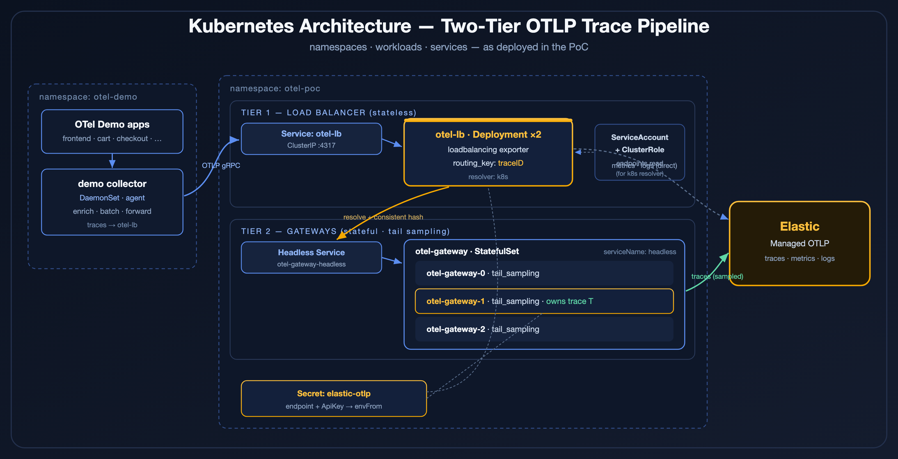
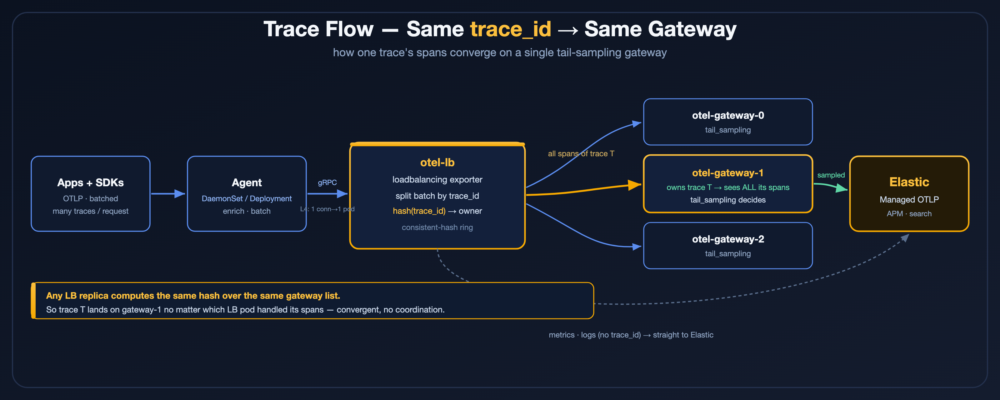
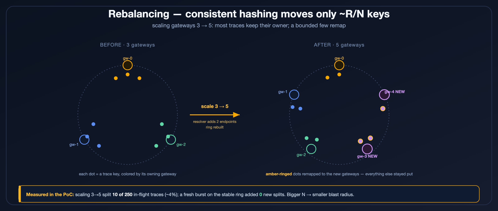
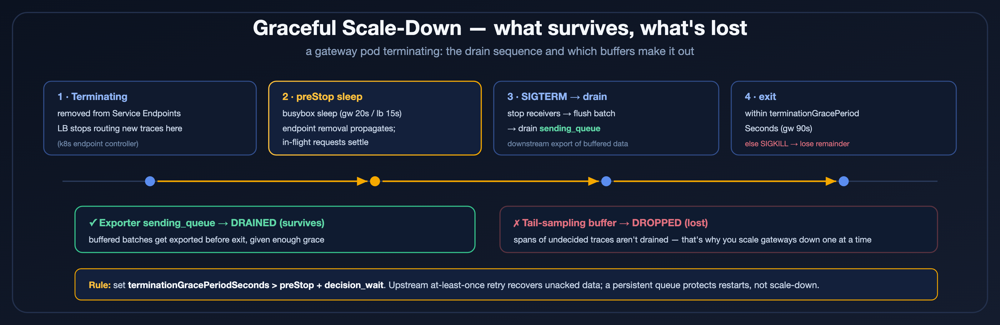

# E2E PoC — LB Deployment + Gateway StatefulSet + OTel Demo → Elastic Managed OTLP

Two-tier trace pipeline — LB tier as a **Deployment**, gateway tier as a **StatefulSet** (stable
identity) — fed by the **OpenTelemetry Demo**, exporting to **Elastic Managed OTLP**.

```
OTel Demo apps → demo collector (agent)
      → otel-lb        (Tier 1, Deployment ×2)   routing_key: traceID
      → otel-gateway   (Tier 2, StatefulSet ×3)  tail_sampling
      → Elastic Managed OTLP   (traces; metrics/logs go direct from otel-lb)
```





## Files
| File | What |
|------|------|
| `00-namespace.yaml` | namespace `otel-poc` |
| `01-elastic-secret.yaml` | **EDIT** — Elastic OTLP endpoint + API key |
| `10-gateway.yaml` | Tier 2: gateway StatefulSet(3) + headless svc + tail_sampling + Elastic export |
| `20-lb.yaml` | Tier 1: LB Deployment(2) + RBAC (k8s resolver) + ClusterIP svc |
| `30-demo-values.yaml` | Helm values for the OTel Demo (egress → otel-lb) |
| `verify-pinning.sh` | proof: no trace split across gateways |

## Prereqs
- A cluster (`minikube start -p edot-demo`) and `kubectl`, `helm`.
- An **Elastic Managed OTLP** endpoint + API key (Elastic Cloud → Add data → OpenTelemetry).

## Deploy
```bash
cd ~/Downloads/test/otlp-trace-loadbalancing/k8s/e2e-elastic

# 0. Edit Elastic creds first!
$EDITOR 01-elastic-secret.yaml

# 1. Namespace + secret + both tiers
kubectl apply -f 00-namespace.yaml
kubectl apply -f 01-elastic-secret.yaml
kubectl apply -f 10-gateway.yaml
kubectl apply -f 20-lb.yaml
kubectl -n otel-poc rollout status statefulset/otel-gateway
kubectl -n otel-poc rollout status deploy/otel-lb

# 2. OpenTelemetry Demo (into the same namespace, so it shares the secret)
helm repo add open-telemetry https://open-telemetry.github.io/opentelemetry-helm-charts
helm repo update
helm upgrade --install otel-demo open-telemetry/opentelemetry-demo \
  -n otel-poc -f 30-demo-values.yaml

# 3. Let traffic flow (~1–2 min) — the demo's loadgenerator drives traces.
kubectl -n otel-poc get pods
```

## Verify
```bash
# A) Trace-id pinning — the decisive test
bash verify-pinning.sh        # expect: ✅ PASS — N traces, ZERO split across gateways

# B) Watch spans of one trace land on one gateway pod
kubectl -n otel-poc logs -l app=otel-gateway --prefix --tail=40 | grep "Trace ID"

# C) Confirm export to Elastic is healthy (no auth/TLS errors)
kubectl -n otel-poc logs -l app=otel-gateway | grep -iE "elastic|export|error" | tail
kubectl -n otel-poc logs -l app=otel-lb      | grep -iE "elastic|export|error" | tail
```
Then open **Elastic → Observability → APM** — services `frontend`, `cartservice`, `checkout`, etc. should appear, with only the **tail-sampled** traces (errors, slow >500ms, ~20% of the rest).

## Rebalancing test (consistent hashing)



```bash
kubectl -n otel-poc scale statefulset/otel-gateway --replicas=5
kubectl -n otel-poc rollout status statefulset/otel-gateway
sleep 50 && bash verify-pinning.sh
```
Expect a **small, bounded** set of "split" trace IDs right after the scale (e.g. ~10) —
these are traces that were *in-flight during the resolver-update window*: some spans hashed
on the old ring, the rest on the new one. That is the documented **~R/N churn**, not a bug.
Prove steady-state is clean by firing a fresh burst on the now-stable ring and re-running —
the split count stays frozen (no *new* splits), while total traces climb:
```bash
kubectl -n otel-poc delete job telemetrygen-traces 2>/dev/null
kubectl create job telemetrygen-traces -n otel-poc \
  --image=ghcr.io/open-telemetry/opentelemetry-collector-contrib/telemetrygen:v0.119.0 \
  -- traces --otlp-endpoint=otel-lb.otel-poc.svc.cluster.local:4317 --otlp-insecure \
     --traces=400 --child-spans=4 --rate=50 --service=poc-postscale
sleep 16 && bash verify-pinning.sh     # same split IDs as before, total much higher
```
Mitigate churn in production: StatefulSet gateways (stable identity), larger N, longer `decision_wait`.

## How it balances — the two layers (demonstrated)
1. **client → LB = per-connection (L4 ClusterIP).** Only spreads with *multiple* client
   connections. One agent/client pins to one `otel-lb` pod.
2. **LB → gateway = per-trace consistent hash.** The `loadbalancing` exporter holds a
   persistent gRPC conn to every gateway pod, splits each batch by `trace_id`, and sends each
   trace on its owner's connection. Deterministic across LB replicas (same ring).

To see layer 1 light up both LB pods, create several client connections (a single-node
DaemonSet collector can't, so use a fleet of senders):
```bash
kubectl create deployment lb-load-fleet -n otel-poc --replicas=6 \
  --image=ghcr.io/open-telemetry/opentelemetry-collector-contrib/telemetrygen:v0.119.0 \
  -- traces --otlp-endpoint=otel-lb.otel-poc.svc.cluster.local:4317 --otlp-insecure \
     --duration=240s --rate=12 --child-spans=3 --service=fleet
# then compare otelcol_receiver_accepted_spans across both otel-lb pods (port-forward :8888)
kubectl -n otel-poc delete deployment lb-load-fleet     # cleanup
```
Observed: previously-idle LB pod went from 1.5k → 3.9k received; both forwarded with 0 drops;
all gateways kept exporting to Elastic with 0 failures.

## Scaling & graceful shutdown



How each tier behaves when you scale, and what happens to in-flight data.

**Shutdown model (both tiers).** On scale-down a pod is removed from the Service Endpoints
(new traffic stops), gets **SIGTERM** → the collector drains (stop receivers → flush batches →
drain exporter queue) → after `terminationGracePeriodSeconds` (**default 30s**) it's **SIGKILL**ed
and anything left in memory is lost. "What survives" = "what drained before the grace period."

**LB tier (stateless — easy).**
- *Scale up:* new pod resolves the gateway list, builds the **same** ring (deterministic), takes
  only **new** connections (existing clients stay pinned by L4). No data movement.
- *Scale down:* clients reconnect to a surviving LB pod. OTLP is **at-least-once** — data the dying
  pod hadn't **ACKed** is retried elsewhere. Only **ACKed-but-not-yet-forwarded** data in its
  in-memory queue is at risk → that's what the grace period drains.

**Gateway tier (stateful — the risky one).**
- *Scale up:* LB ring remaps ~R/N trace keys to the new pod (brief churn window); the new pod starts
  with an **empty** tail-sampling buffer. No state transfer needed.
- *Scale down:* two losses — (1) the **tail-sampling buffer** (spans awaiting a decision) is
  **dropped**, because it's a buffer, not a queue, and isn't drained; (2) in-flight traces go
  **partial** as their IDs re-hash to a new gateway. **Scale gateways down one at a time.**

**Two kinds of "pending" — protected differently:**

| Pending data | On scale-down | Notes |
|---|---|---|
| Exporter `sending_queue` | best-effort **drained** within grace period, else dropped | bigger grace / preStop helps |
| Tail-sampling **buffer** | **dropped** (not drained) | only `decision_wait` tuning + slow scale-down |

⚠️ A **persistent queue** (`file_storage`) protects **restarts** (same volume returns) — **not**
scale-down, where the Deployment pod and its `emptyDir` are gone for good. The real backstop is
**upstream at-least-once retry**.

**Settings applied in these manifests:**
- Gateway `terminationGracePeriodSeconds: 90` (must exceed preStop 20s + `decision_wait` 10s).
- LB `terminationGracePeriodSeconds: 45` (exceeds preStop 15s + drain).
- **`preStop` drain is enabled** via a busybox trick (the contrib image is shell-less/scratch, so
  `exec ["/bin/sh","sleep"]` would fail). An **initContainer** (`drain-tools`, **`busybox:1.36.1-musl`**)
  copies the `busybox` binary into a shared `emptyDir` (`drain-bin`); the collector's `preStop` then
  runs `["/drain/busybox","sleep",N]` — `exec` invokes the binary directly, no shell needed.
  - ⚠️ **Must be the `-musl` (static) tag.** The default `busybox:1.36` is glibc-**dynamic**; copied
    into the scratch collector container it fails at exec with `no such file or directory` (missing
    interpreter) and the preStop silently no-ops. Verified: with `-musl`, a pod deletion blocks for the
    full sleep (gateway ~21s, LB ~16s); with the dynamic image it returned in ~0s.
  - *Why an initContainer, not a literal sidecar:* `preStop` is per-container, so the delay must be
    on the **collector** container; a separate long-running sidecar can't hold up the collector's
    SIGTERM. The initContainer only **stages the binary** the collector's own hook needs.
  - *Sequence on scale-down:* pod removed from Endpoints → collector `preStop sleep` (LB stops
    routing here, in-flight settles) → SIGTERM → collector drains queue → exit, all inside the grace
    period. Keep `terminationGracePeriodSeconds > preStop + decision_wait`.

**Harden further:** scale gateways down 1 pod at a time; use a **StatefulSet** for gateways (stable
identity → smaller remap); keep grace > `decision_wait`; add `file_storage` only for restart
durability (not scale-down).

## Tear down
```bash
kubectl -n otel-poc delete deployment lb-load-fleet 2>/dev/null
kubectl -n otel-poc scale statefulset/otel-gateway --replicas=3   # back to steady state
# stop the load / remove everything:
helm -n otel-demo uninstall otel-demo        # or: helm -n otel-demo rollback otel-demo 4
kubectl delete ns otel-poc
minikube stop -p edot-demo                    # pause cluster (keeps state)
```

## Notes / gotchas
- **`01-elastic-secret.yaml` must be edited** — placeholders won't authenticate. Endpoint is `host:443` (drop any `https://`).
- LB tier uses the **k8s resolver** → the included **RBAC** (endpoints/endpointslices read) is required.
- `verify-pinning.sh` counts only **tail-sampled** traces (that's what reaches the gateway exporter). The disjointness proof still holds on that subset. To verify on 100% of traces, temporarily set the gateway's `sample-the-rest` `sampling_percentage: 100` and re-apply `10-gateway.yaml`.
- Gateway is a **StatefulSet** (`serviceName: otel-gateway-headless`) for stable pod identities (`otel-gateway-0/1/2`) → stable hash ring across restarts and one-at-a-time scale-down. The LB tier stays a Deployment (stateless).
- Chart pipeline keys can vary by version — if `30-demo-values.yaml` is rejected, run `helm show values open-telemetry/opentelemetry-demo` and align.

## Verified run (2026-06-18, minikube `edot-demo`, chart 0.40.9 → Elastic Managed OTLP)
Result: ✅ trace-id pinning held (107 demo traces, 0 split), all 3 gateways exported to
Elastic with `otlp/elastic send_failed_spans = 0`, LB `loadbalancing send_failed = 0`.
- **Rebalancing 3→5:** new gateways received pinned traffic + exported to Elastic immediately;
  exactly 10 transitional traces split (the in-flight window); a fresh 400-trace burst on the
  stable ring added **0** new splits (250 → 358 total, splits frozen at 10).
- **Multi-client balancing:** a 6-pod sender fleet lit up the previously-idle LB pod
  (1.5k → 3.9k received); both LB pods forwarded with 0 drops.

Two gotchas hit on a cluster that already had an `otel-demo` release:
1. **`ClusterRole "otel-collector"` conflict** — a fresh `helm install` into a new
   namespace fails because that ClusterRole is cluster-scoped and already owned by the
   other release. Fix used here: instead of a 2nd demo, reuse the existing release —
   `helm upgrade otel-demo -n otel-demo --reuse-values -f 31-demo-reuse-override.yaml`
   (repoints only the traces pipeline at `otel-lb.otel-poc:4317`). `31-demo-reuse-override.yaml`
   is included. (Disabling collector presets + `clusterRole.create:false` did NOT stop
   the chart rendering it in this version.)
2. **Parked collector** — the demo collector DaemonSet was held down with
   `nodeSelector: {stopped: "true"}`; `--reuse-values` keeps it. Un-park directly:
   `kubectl -n otel-demo patch ds otel-collector-agent --type=json -p '[{"op":"remove","path":"/spec/template/spec/nodeSelector/stopped"}]'`

Note: with one demo collector (one gRPC client) the LB ClusterIP pins it to a single
`otel-lb` pod — expected L4 behavior; that pod still fans out by trace_id correctly.
